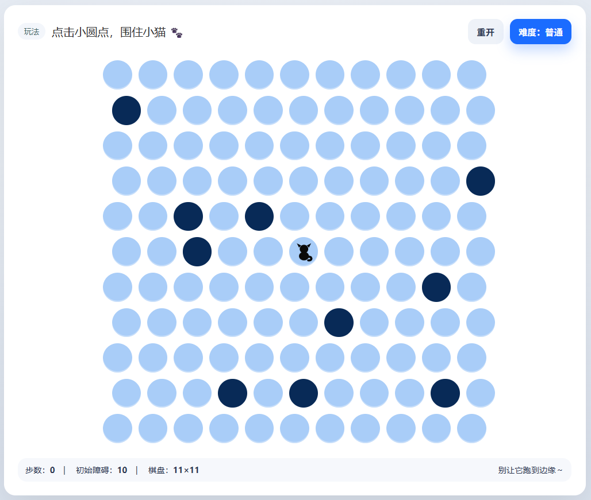

# cat-trap

围住小猫 - 一个基于六边形网格的策略游戏

## 游戏简介

《围住小猫》是一个有趣的策略游戏，玩家需要通过放置障碍物来阻止小猫逃到棋盘边缘。小猫会智能地寻找逃生路径，玩家需要预测并封堵其路线。

## 玩法

1. 点击棋盘上的圆点放置障碍物
2. 阻止小猫到达棋盘边缘
3. 小猫会自动移动，寻找最优逃生路径
4. 成功围住小猫即可获胜

## 难度级别

- **简单**: 12个初始障碍物，随机模式
- **普通**: 10个初始障碍物，目标导向模式
- **困难**: 7个初始障碍物，增强目标导向模式
- **地狱**: 5个初始障碍物，地狱模式（迭代加深搜索）

## 技术栈

- HTML5
- CSS3 (响应式设计)
- JavaScript (ES6+)

## 如何运行
打开网页即可开始游戏：https://wf1woi.github.io/cat-trap/
或者直接在浏览器中打开 `index.html` 文件即可开始游戏。

## 特性

- 六边形网格布局
- 智能AI小猫（使用搜索算法）
- 多种难度级别
- 响应式设计，支持移动设备
- 胜利动画效果
- 无需安装，纯前端实现

## 游戏规则

- 玩家轮流放置障碍物
- 小猫每次移动一步
- 如果小猫到达边缘，玩家失败
- 如果小猫无路可逃，玩家胜利

## 浏览器支持

支持所有现代浏览器，包括 Chrome、Firefox、Safari 和 Edge。
且兼容移动端。
